

# ahj-chaos-organizer

## [Frontend](https://antis85.github.io/ahj-chaos-organizer/)

## [Backend](https://ahj-chaos-organizer.herokuapp.com/)

### Обязательные для реализации функции

* Сохранение в истории ссылок и текстовых сообщений. Сохранение по нажатию Enter:
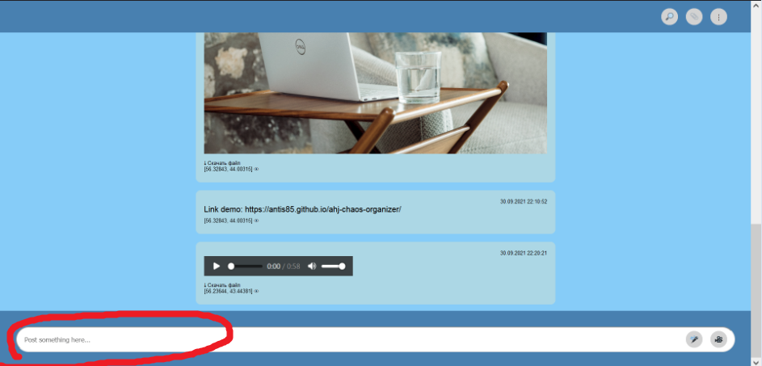

* Ссылки (то, что начинается с `http://` или `https://`) должны быть кликабельны и отображаться как ссылки:
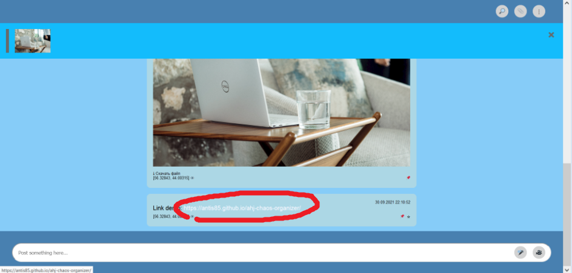

* Сохранение в истории изображений, видео и аудио (как файлов) - через Drag & Drop и через иконку загрузки (скрепка в большинстве мессенджеров):
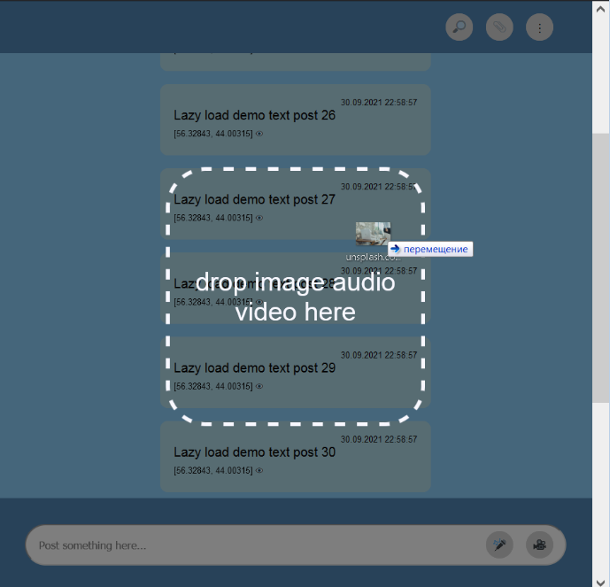
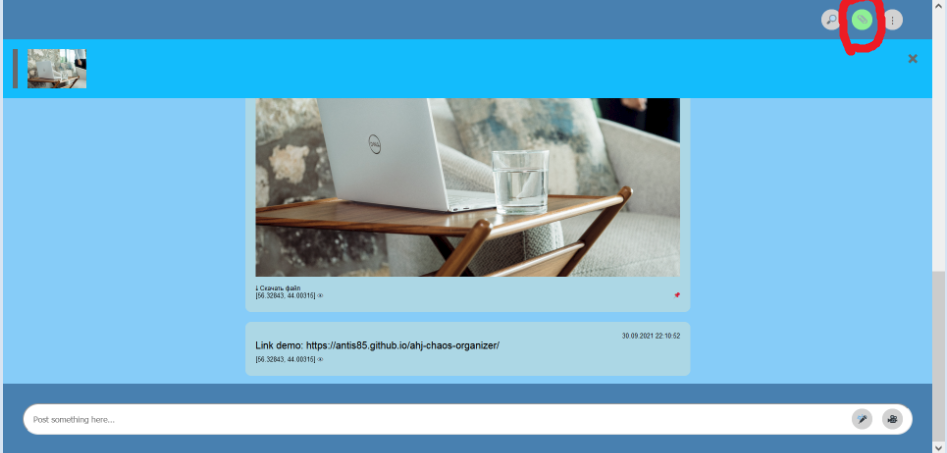

* Скачивание файлов (на компьютер пользователя). Для скачивания файлов предусмотрена кнопка "Скачать файл" в нижней части сообщения:
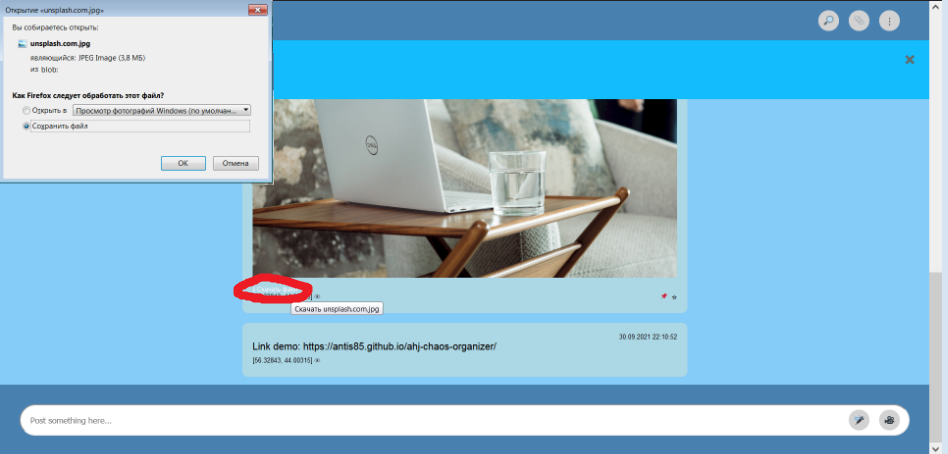

* Ленивая подгрузка: сначала подгружаются последние 10 сообщений, при прокрутке вверх подгружаются следующие 10 и т.д.

### Дополнительные для реализации функции

* Синхронизация - если приложение открыто в нескольких окнах (вкладках), то контент должен быть синхронизирован

* Запись видео и аудио (используя API браузера). Для этого нужно нажать соответствующую кнопку записи в нижней части экрана. При этом потребуется выдать разрешение на запись. После нажатия кнопки записи появится таймер и кнопки сохранения("V") и отмены("X") записи:
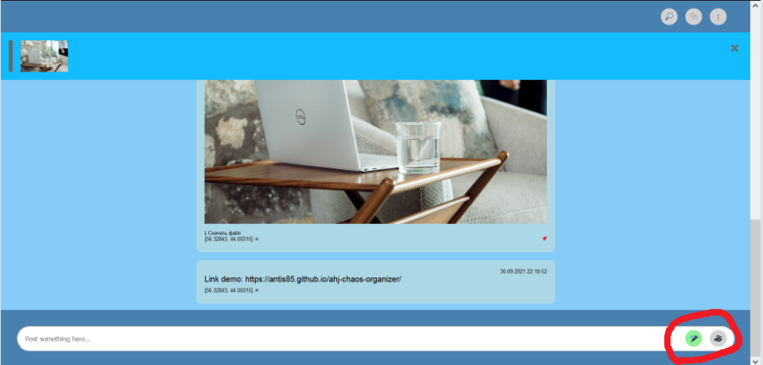
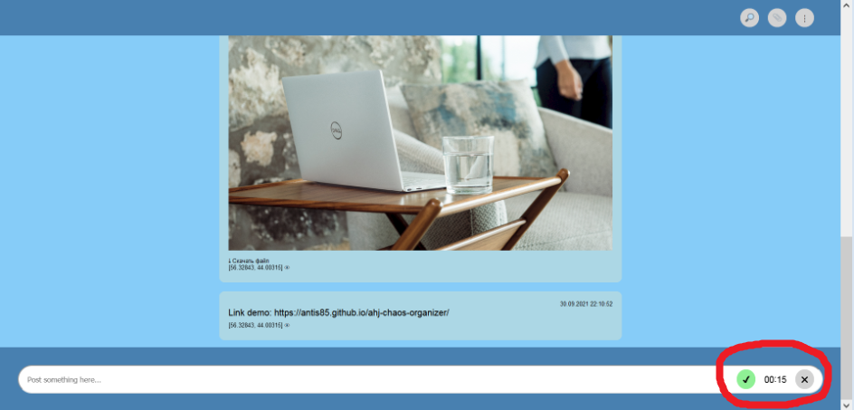

* Отправка геолокации. При этом потребуется выдать разрешение на получение координат пользователя. Если разрешение не выдано или координаты не получены, то появляется окно для ручного ввода координат(при нажатии кнопки "Отмена" сообщение будет сохранено без геолокации):

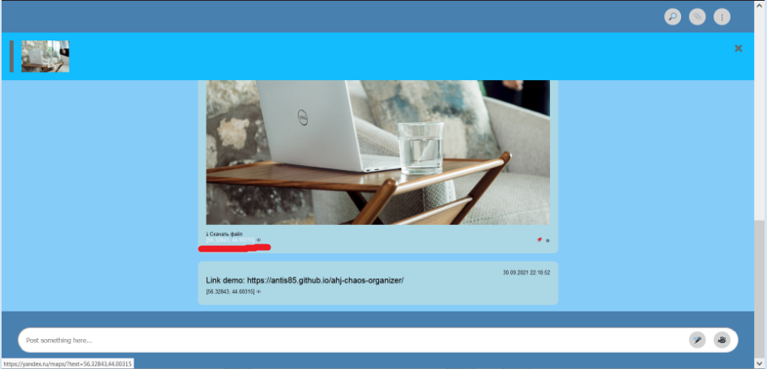

* Воспроизведение видео/аудио (используя API браузера).
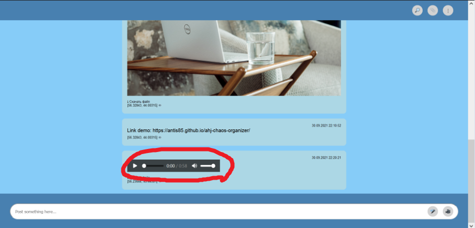

* Закрепление (pin) сообщений, закреплять можно только одно сообщение (прикрепляется к верхней части страницы). Для закрепления сообщения нужно навести на него указатель мыши - появится иконка для закрепления, после нажатия на которую сообщение прикрепляется к верхней части страницы:
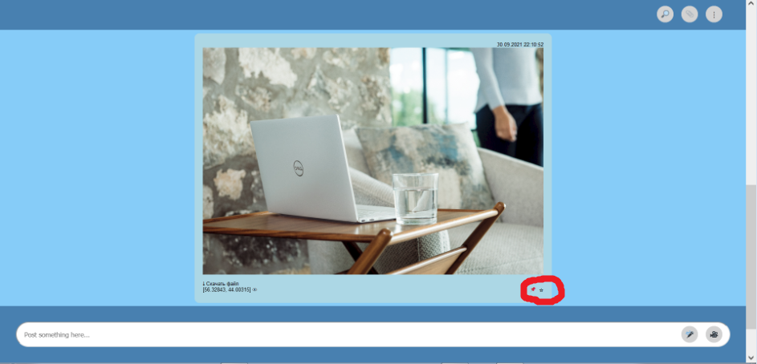
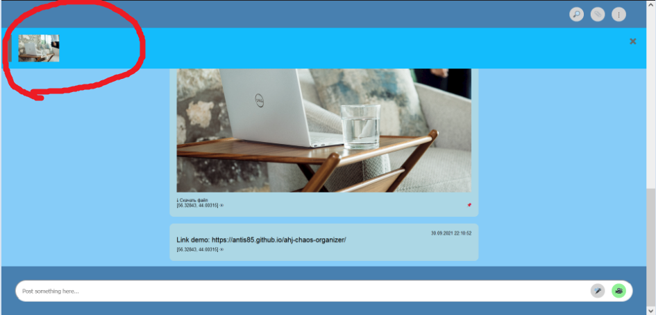
